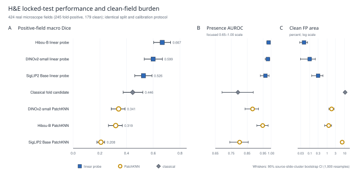
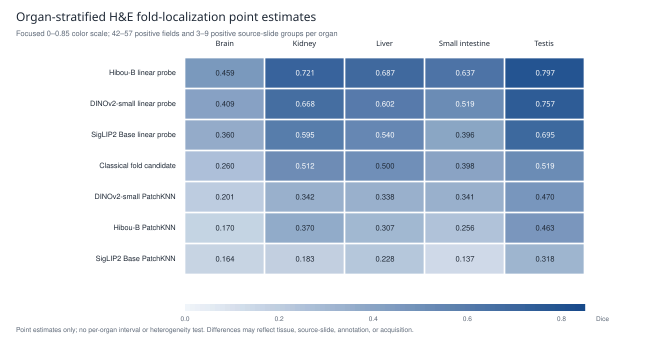
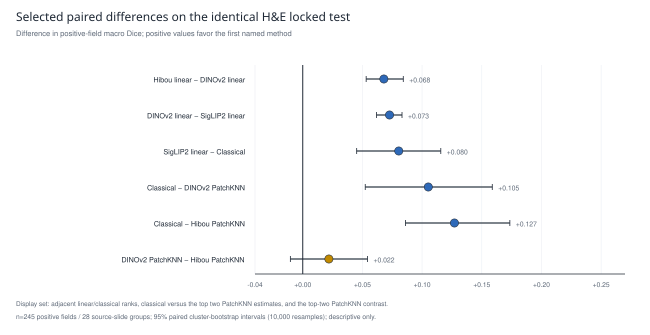
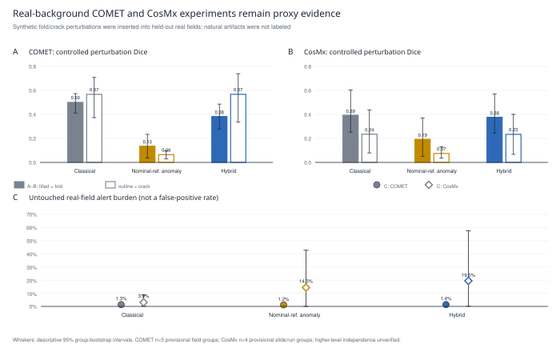
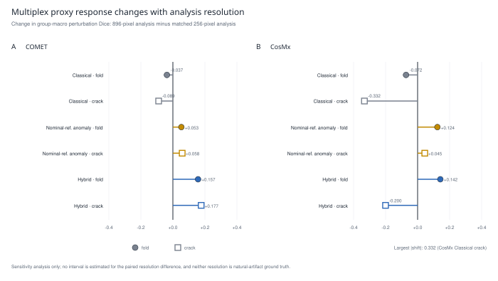
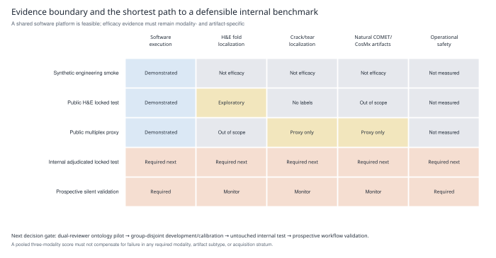

# Fold and Crack Artifact QC Across H&E, COMET, and CosMx

**Technical findings report · 2026-08-27 · Evidence status: internal feasibility, share with caveats**

## Technical summary

The repository now supports one supplied-source-slide-disjoint, cohort-conditional exploratory real-label comparison for **tissue-fold localization on public H&E microscope fields**. The strongest point estimate was **Hibou-B linear probe**, with positive-field macro Dice **0.667 (95% source-slide-cluster bootstrap CI 0.603–0.730)**, all-field micro Dice 0.827, field-presence AUROC 0.985, and 0.047% predicted area on clean fields.

That result is promising, but it is not yet a WSI, crack, COMET, CosMx, comprehensive-SOTA, or deployment claim. The best H&E readout uses manual fit-set masks to train a shallow linear probe on frozen features. The real-background COMET and CosMx experiments use inserted synthetic perturbations and therefore establish decode/runtime compatibility and generator-conditional detector response—not natural-artifact accuracy. No public COMET/CosMx natural fold-or-crack annotation set was located in the source audit completed 2026-08-27 [20–23].

The correct architecture is consequently a **shared QC platform with modality-specific channel construction, reference banks, calibration, and acceptance gates**. The immediate high-value step is a blinded, adjudicated internal pilot. Foundation-model expansion is warranted only under matched readouts and cleared licenses: retain DINOv2 as a permissive generic control; add DINOv3 after legal review; treat UNI2-h/CONCHv1.5 as H&E encoders; and evaluate KRONOS2 for marker-aware COMET only after written commercial and derivative-use permission.

## Decision and claim boundary

| Evidence tier | Data | What may be claimed | What must not be claimed |
| --- | --- | --- | --- |
| Real H&E held-out test | 424 fields from 55 supplied source-slide groups; manual fold masks | Cohort-specific H&E fold localization/presence and clean-field alert burden | WSI, human-clinical, crack, COMET/CosMx, or deployment performance |
| Real-background multiplex proxy | 5 COMET DAPI fields and 6 CosMx morphology FOVs/4 slide-run IDs; synthetic insertions | Pipeline compatibility, perturbation response, transform checks, alert burden | Natural-artifact Dice, ROC, sensitivity, specificity, or false-positive rate |
| Foundation/LoRA smoke | Two deterministic RGB patches per model | MPS execution, CPU/MPS parity, one rank-4 update | Accuracy, throughput at WSI scale, generalization, or PEFT benefit |

**Recommendation:** advance to a governed internal annotation and locked-test pilot. Do not represent the present package as production validated or as a comprehensive SOTA benchmark.

## 1. Real H&E fold benchmark

### Dataset and split

The [Histology Tissue Fold Dataset v1](https://zenodo.org/records/21493260) comprises 2,127 real 3,840 W × 2,160 H px RGB images acquired at 10× from veterinary teaching slides: 1,228 fold-positive fields with manual masks and 899 clean fields across brain, kidney, liver, small intestine, and testis [1,2]. Supplied source-slide IDs were stratified by organ and class and assigned to fit, calibration, and test in a 60:20:20 ratio. The hardened split contains 1,276 fields/170 slides for fit, 427/58 for calibration, and **424/55 for locked test**. No field or supplied source slide crosses partitions. Two supplied positive masks were empty; their presence labels were retained, while those fields were excluded from localization fitting/calibration under the frozen policy.

The locked test contains 245 valid fold-positive fields from 28 positive source-slide groups and 179 clean fields from 27 clean groups. This is real annotated microscopy, but it is **not WSI**, contains no crack class, and has no patient/block identifiers beyond supplied slide ID.

### Methods

All methods use the identical split, 896-pixel maximum analysis dimension, 224-pixel tiling, and calibration-only operating-point selection.

- The classical candidate detector combines optical-density, saturation, texture, and morphology signals. It uses no fit masks, but its operating threshold uses calibration labels.
- Frozen DINOv2-small, Hibou-B, and SigLIP2 Base encoders provide spatial tokens [7,10–13]. The “PatchKNN” readout uses up to 4,096 clean-labeled fit tokens and three nearest neighbours; it is PatchCore-like, not a full PatchCore implementation, and uses calibration masks for thresholding.
- The class-balanced linear probe uses up to 8,192 tokens per class derived from fit-set pixel masks. It is lightly supervised, not zero-shot or unsupervised; only the encoder remains frozen.

Localization thresholds maximize pooled calibration pixel Dice over a deterministic score-quantile grid. Presence uses the 99.5th percentile of each score map and a calibration threshold maximizing balanced accuracy. Thresholds are fixed before locked-test inference. Reported intervals resample supplied source-slide groups within organ/class strata and condition on one fixed split, fit, random reservoir, and threshold.

**Figure 1. H&E locked-test fold performance.** (A) Positive-field macro Dice. (B) Field-presence AUROC. (C) Predicted positive pixel area on clean fields, shown on a log scale. Whiskers in all panels are 95% source-slide-cluster bootstrap intervals from 1,000 resamples; marker shape distinguishes readout type. All methods use the same 424-field test cohort, but readout supervision differs; cross-head rankings should not be interpreted as controlled backbone comparisons.

| Method | Readout | Positive-field macro Dice (95% CI) | All-field micro Dice (95% CI) | Presence AUROC (95% CI) | Clean predicted area (95% CI) |
| --- | --- | --- | --- | --- | --- |
| Hibou-B linear probe | Linear probe | 0.667 (0.603–0.730) | 0.827 (0.791–0.852) | 0.985 (0.973–0.994) | 0.047% (0.026–0.076) |
| DINOv2-small linear probe | Linear probe | 0.599 (0.532–0.668) | 0.770 (0.724–0.802) | 0.980 (0.963–0.991) | 0.098% (0.029–0.209) |
| SigLIP2 Base linear probe | Linear probe | 0.526 (0.462–0.590) | 0.679 (0.625–0.714) | 0.965 (0.933–0.988) | 0.299% (0.127–0.577) |
| Classical fold candidate | Classical | 0.446 (0.375–0.521) | 0.383 (0.318–0.446) | 0.792 (0.692–0.888) | 10.731% (10.094–11.425) |
| DINOv2-small PatchKNN | PatchKNN | 0.341 (0.285–0.389) | 0.434 (0.352–0.497) | 0.884 (0.836–0.921) | 1.789% (1.247–2.474) |
| Hibou-B PatchKNN | PatchKNN | 0.319 (0.264–0.368) | 0.418 (0.362–0.457) | 0.947 (0.910–0.981) | 1.221% (0.717–1.768) |
| SigLIP2 Base PatchKNN | PatchKNN | 0.208 (0.178–0.236) | 0.224 (0.177–0.257) | 0.803 (0.740–0.856) | 7.282% (5.876–8.605) |

### Main finding

The three mask-supervised linear probes have the highest point estimates in this cohort. The observed Hibou-B linear minus DINOv2 linear difference is **+0.068 Dice (descriptive paired 95% interval +0.053 to +0.084)** on the identical locked fields; DINOv2 linear minus SigLIP2 linear is +0.073 (+0.062 to +0.083). The strongest one-class localization point estimate is DINOv2 PatchKNN at 0.341 macro Dice; Hibou PatchKNN nevertheless achieves 0.947 presence AUROC, demonstrating that field ranking and semantic pixel localization are distinct tasks.

**Figure 2. Organ-stratified H&E fold localization.** Positive-field macro Dice point estimates on a focused 0–0.85 color scale. Hibou-B linear spans **0.459 in brain to 0.797 in testis**. The five organs contain 42–57 positive fields but only 3–9 positive supplied source-slide groups each. No per-organ interval or heterogeneity test was computed; differences may reflect tissue, source composition, acquisition, or annotation.

**Figure 3. Selected paired H&E contrasts.** Differences in positive-field macro Dice across 245 positive fields from 28 supplied source-slide groups, with 95% intervals from 10,000 common cluster-bootstrap draws. The display includes adjacent linear/classical ranks, classical versus the two highest PatchKNN point estimates, and the top-two PatchKNN contrast; remaining pairwise contrasts are not shown. Positive values favor the first method. The analysis is descriptive: no p-values, multiplicity control, noninferiority margin, or superiority claim was applied.

| Paired contrast | Dice difference | Descriptive 95% interval |
| --- | --- | --- |
| Hibou-B linear probe − DINOv2-small linear probe | +0.068 | +0.053 to +0.084 |
| DINOv2-small linear probe − SigLIP2 Base linear probe | +0.073 | +0.062 to +0.083 |
| SigLIP2 Base linear probe − Classical fold candidate | +0.080 | +0.045 to +0.116 |
| Classical fold candidate − DINOv2-small PatchKNN | +0.105 | +0.052 to +0.159 |
| Classical fold candidate − Hibou-B PatchKNN | +0.127 | +0.086 to +0.174 |
| DINOv2-small PatchKNN − Hibou-B PatchKNN | +0.022 | -0.010 to +0.054 |

### H&E uncertainty and validity

The highest-impact aggregates were independently recomputed from per-field TP/FP/FN, and exact cohort/order identity was asserted across all seven rows. No direct slide leakage or duplicate image hash was found. However, this same public test has been inspected across multiple development cycles; any further selection based on these results risks adaptive test-set overfitting. The bootstrap does not capture split uncertainty, inter-reader variability, training-seed variability, model-selection bias, or domain shift. All pixels outside fold masks are treated as negatives without a tissue-specific ignore mask.

## 2. COMET and CosMx: real-background proxy, not natural-artifact validation

Five public COMET DAPI fields [20,21] and six five-channel CosMx morphology FOVs from four distinct slide/run identifiers [22,23] were decoded successfully. They lack natural fold/crack masks. The benchmark therefore inserts controlled fold-like shifted-signal perturbations and crack-like all-channel attenuation into real backgrounds, then evaluates the nonnegative incremental score relative to each untouched field. The nominal anomaly reference bank is fitted from **unannotated fields, not expert-confirmed clean fields**, so natural artifacts could be absorbed into the reference distribution. Thresholds are selected on calibration perturbations. Leave-one-declared-group-out test coverage is complete, but training/calibration groups recur across folds and higher-level biological independence is unverified.

**Figure 4. Multiplex proxy response and alert burden.** (A–B) Group-macro Dice against inserted fold/crack perturbation supports; filled/outlined bars denote fold/crack. These values quantify generator-conditional incremental response, not natural-artifact accuracy. (C) Predicted area on untouched real fields; circles/diamonds denote COMET/CosMx. Those fields were not adjudicated as artifact-free, so the quantity is alert burden—not false-positive rate.

| Modality | Method | Fold perturbation Dice (95% CI) | Crack perturbation Dice (95% CI) | Untouched alert burden (95% CI) |
| --- | --- | --- | --- | --- |
| COMET | Classical | 0.500 (0.412–0.573) | 0.567 (0.373–0.708) | 1.34% (0.68–2.11) |
| COMET | Nominal-reference anomaly | 0.135 (0.036–0.234) | 0.065 (0.029–0.098) | 1.15% (0.49–1.82) |
| COMET | Hybrid | 0.382 (0.279–0.486) | 0.567 (0.335–0.739) | 1.36% (0.68–2.16) |
| CosMx | Classical | 0.393 (0.252–0.603) | 0.235 (0.079–0.438) | 3.04% (0.12–8.68) |
| CosMx | Nominal-reference anomaly | 0.193 (0.050–0.369) | 0.075 (0.035–0.129) | 14.33% (0.00–42.76) |
| CosMx | Hybrid | 0.376 (0.242–0.569) | 0.234 (0.067–0.401) | 19.46% (0.08–57.61) |

The nominal-reference anomaly branch produces crack-response Dice of only **0.065 on COMET** and **0.075 on CosMx**. Recorded coverage, finite-score, paired-subtraction, deterministic rerun, flip/inverse-transform, and empty-map checks identified no runtime or transformation failure. The weak response is consistent with a representation/channel/physical-scale/threshold mismatch, although those checks cannot exclude every semantic implementation defect. The correct operational conclusion is that the present configuration should not ship; it is not that anomaly detection as a field is invalid.

**Figure 5. Multiplex proxy resolution sensitivity.** Signed change in group-macro perturbation Dice from 256- to 896-pixel analysis for each matched modality, method, and artifact. The largest absolute change is **0.332** for CosMx Classical crack; no interval is estimated for these paired configuration differences. This is an engineering sensitivity analysis, not natural-artifact validation.

The proxy is explicitly marked `report_eligible=false` and `scientific_validation_passed=false`. Its 5 COMET fields are DAPI-only and lack usable MPP metadata in the current manifest; CosMx uses all five morphology channels as structural input. Pooling them into a unified accuracy score would be scientifically invalid.

## 3. Foundation models, SOTA coverage, and compute feasibility

| Model or method | Status in this repository | Recommended role |
| --- | --- | --- |
| HistoQC | Not run in this repository | Add as an open operational QC baseline; define an output-to-fold mapping before localization scoring |
| GrandQC | Not run; public manual test masks exist | Strong public comparator after written clearance |
| DiffusionQC | Paper only; no official public code/checkpoint found | Internal reproduction is preferable to reimplementation |
| Hibou-B | Frozen PatchKNN and mask-supervised linear probe completed | Retain as current pathology-specific H&E comparator |
| DINOv2-small | Frozen heads plus MPS/LoRA engineering smoke completed | Retain as stable, permissive generic control |
| DINOv3 | Not run | Run same frozen heads after approval; newer is not evidence of superiority |
| UNI2-h | Not run | Defer until license and 681M-model resource case are justified |
| CONCHv1.5 | Not run; no official CONCH v2 located | Use exact model ID; defer until legal and semantic-use case are clear |
| KRONOS2 | Not run; no fold/crack localization head | Most aligned reviewed frozen COMET candidate after written approval and labels |

The current executable H&E registry contains only DINOv2, Hibou-B, and SigLIP2 [7,10–13]. HistoQC [3], GrandQC [4,5,30], DiffusionQC [6], DINOv3 [8,9], UNI2-h [14], CONCHv1.5 [16], KRONOS2 [18], PaDiM, full PatchCore, U-Net, and SegFormer were **not executed**. References 15, 17, and 19 describe the original UNI, CONCH, and KRONOS lineages, respectively—not validation studies of UNI2-h, CONCHv1.5, or KRONOS2. Accordingly, this is not yet a comprehensive SOTA leaderboard.

DINOv2 remains worth retaining because it is a stable Apache-2.0 generic dense-feature control [7,29]; newer does not imply better for histology artifacts. DINOv3 is a worthwhile general-vision addition after Meta-license review [8,9]. UNI2-h and CONCHv1.5 are pathology encoders, not artifact segmenters, and require a matched dense readout [14,16]. No official “CONCH v2” checkpoint was located in the official-source search completed 2026-08-27. KRONOS2 is the most technically aligned public marker-aware candidate among those reviewed for COMET-like multiplex IF [18], but it is not a ready detector and is only partially relevant to CosMx morphology/protein—not decoded transcript coordinates; the KRONOS paper [19] is lineage context, not KRONOS2 validation.

The UNI2-h, CONCHv1.5, and KRONOS2 cards use gated CC BY-NC-ND terms [14,16,18]. At Merck, frozen feature extraction and especially LoRA must not be presumed permitted; obtain written institutional approval first. HistoQC is an open operational WSI-QC baseline [3], not a directly scoreable fold-localization comparator until its outputs are mapped to the project ontology and metric contract. GrandQC is scientifically important but noncommercial [30]. No public DiffusionQC code/checkpoint was located in the author, publisher, and repository search completed 2026-08-27; because the paper includes Merck authors, internal asset and exact-split access is preferable to reimplementation.

### Apple MPS and LoRA engineering smoke

| Model | CPU median (two patches) | MPS median (two patches) | Observed speed-up | Max \|CPU−MPS\| | LoRA trainable fraction |
| --- | --- | --- | --- | --- | --- |
| DINOv2-small | 0.03778 s | 0.01672 s | 2.26× | 0.000179 | 0.113% |
| SigLIP2 Base | 0.12350 s | 0.03236 s | 3.82× | 0.001146 | 0.054% |

Both DINOv2-small and SigLIP2 Base completed finite frozen inference on Apple MPS with close CPU agreement and a one-step rank-4 LoRA update. These two-patch smokes establish only engineering feasibility. The runtime currently resolves `auto` to **MPS then CPU** and does not accept or detect CUDA; automatic CUDA/MPS support should not be claimed until explicit CUDA selection, synchronization, and parity tests are added.

## 4. Public datasets suitable for the next benchmark

| Resource | Ground truth and best use | Critical limitation |
| --- | --- | --- |
| [GrandQC manual test set](https://zenodo.org/records/14039591) [4,5] | Expert patch/crop-level artifact masks sampled from H&E WSIs; useful external patch-level benchmark | No distinct crack class; noncommercial method assets [30]; deliberate artifact enrichment |
| [AIRAQc TCGA test](https://openreview.net/attachment?id=XNNsQqs1UP&name=pdf) [24] | 50 manually annotated real TCGA H&E WSIs | Verify release URL, exact files, and split before use |
| [Histology Tissue Fold Dataset v1](https://zenodo.org/records/21493260) [1,2] | 1,228 fold masks plus 899 clean fields; current real benchmark | Teaching-slide microscope fields, not WSI; fold only |
| [HistoArtifacts](https://zenodo.org/records/10809442) [25,26] | Patch labels including fold and damaged tissue | No dedicated pixel crack masks; license needs confirmation |
| [Foucart artifact WSI set](https://zenodo.org/records/3773097) [27,28] | Partial Tear&Fold and knife-damage annotations on 22 WSIs | Most artifacts unannotated; ordinary negative-pixel Dice is invalid; license blank |
| Public COMET/CosMx releases [20–23] | Real fields for compatibility, drift, and blinded annotation pilots | No fold/crack ground truth found |

GrandQC TCGA masks are model-generated pseudo-labels and must not be used as independent ground truth. No mature public dataset with a separate, complete, pixel-level histologic crack class was found; tear, knife damage, or damaged tissue are only proxies. There is no single labeled cross-modality H&E–COMET–CosMx benchmark.

## 5. Evaluation criteria for the internal locked study

The evaluation must define modality, artifact ontology, unit of inference, and operational action before annotation. Fold and crack should not share a primary geometric endpoint: folds are regions, while cracks/tears are often thin branching structures.

**Figure 6. Evidence boundary and validation sequence.** The current software platform executes across all three input types, but natural-label efficacy is limited to H&E folds. A dual-reviewer ontology pilot, group-disjoint development/calibration, untouched internal test, and prospective silent validation are sequential—not interchangeable—evidence gates.

| Criterion | Proposed gate | Cohort |
| --- | --- | --- |
| Severe actionable artifact sensitivity | 95% CI lower bound ≥ 0.95 | Enriched adjudicated challenge cohort |
| Safety of automatic PASS | 95% CI lower bound for NPV ≥ 0.99 | Production-prevalence cohort |
| High-confidence localization precision | 95% CI lower bound ≥ 0.95 | Adjudicated mask subset |
| Valid-tissue overmask | Mean ≤ 0.5% | Prevalence and hard-negative cohorts |
| Review referral rate | ≤ 25% | Production-prevalence cohort |
| Missing, invalid or OOD input | 100% routes to REVIEW | Degraded-input cohort |
| Downstream assay effect | Meets approved noninferiority margin | Paired downstream-impact cohort |

Additional design requirements:

1. Split at the highest available patient/block/slide/run unit; keep all regions and repeated scans from that unit together.
2. Predeclare production-prevalence, enriched-challenge, external-generalization, degraded-input, and downstream-impact cohorts. Do not pool a primary score across H&E, COMET, and CosMx.
3. Use two blinded reviewers plus adjudication; include tissue/background validity and ignore regions; report inter-reader agreement.
4. For folds, prioritize positive-slide macro Dice, lesion sensitivity, surface Dice at a physical tolerance, and clean-tissue overmask burden.
5. For cracks/tears, prioritize clDice or tolerant centerline F1, lesion sensitivity, false components per tissue area, and fragmentation; keep pixel Dice diagnostic.
6. For triage, report average precision/AUROC and sensitivity at a prespecified review burden. Raw score quantiles are not calibrated probabilities; do not report ECE/Brier until probability calibration is defined.
7. Repeat head fitting/reference-bank sampling and calibration across seeds, or use nested resampling that refits; bootstrap the highest independent unit.
8. Predeclare DAPI-only, morphology-RGB, and all-structural channel ablations with semantic marker roles and microns-per-pixel. Test missing/swapped channels and batch shifts.
9. Measure WSI latency, peak memory, failed/abstained inputs, review area, and downstream assay impact. Synthetic perturbations remain regression/stress tests only.

The numerical thresholds above are **proposed starting hypotheses**, not established Merck requirements. They require stakeholder approval and power analysis based on production prevalence and asymmetric costs of false PASS versus false FAIL.

## 6. Prioritized implementation plan

1. **Lock the ontology and action.** Separate tissue fold, tissue tear, glass/coverslip crack, knife line, and acquisition seam; map each to PASS/REVIEW/FAIL and remediation.
2. **Build an adjudicated pilot.** Aim initially for at least 30 independent patient/slide/run groups per modality, enriched to at least 50 fold-positive, 50 crack-positive, and 100 clean/hard-negative regions, then revise through power analysis.
3. **Add accessible controls.** Execute HistoQC as an operational WSI-QC baseline after defining its output-to-fold ontology/metric mapping, verify AIRAQc access, seek GrandQC permission, and obtain Merck's DiffusionQC code/checkpoints and exact split metadata.
4. **Use matched readouts.** Compare classical, DINOv2, Hibou-B, and approved DINOv3 under the same frozen heads. Add a small decoder or LoRA only after a predeclared frozen-model criterion fails.
5. **Open a governed multiplex track.** Define marker vocabulary, MPP, channel presence/order, and projection baselines. Request KRONOS2 permission, then pair it with a localization head and real labels.
6. **Close deployment gaps.** Add CUDA auto-detection and parity tests; preserve score maps/masks for overlays; add WSI pyramid I/O, seam handling, peak-memory tests, and technical abstention.

## 7. Hash-selected qualitative audit

**Figure 7. Audited whole-field H&E localization examples.** The 7 displayed fields were algorithmically selected without manual image review during this audit as the SHA-256-minimum fold-positive field within each organ plus the SHA-256-minimum presence FP and FN separately for each compared method; the union was deduplicated. The whole 896 W × 504 H px analysis fields were isotropically resized from 3,840 W × 2,160 H px and were not cropped. Solid teal with a white halo marks the supplied reference fold mask, dashed orange the classical prediction, and dotted magenta the Hibou-B linear-probe prediction. TP/FP/FN/TN denote the image-presence operating point; Dice is the pixel-localization value on fold fields. Presence calls and pixel masks use separate locked thresholds; a presence TN or FN may still contain thresholded localization pixels. All regenerated pixel counts and presence calls matched the frozen artifacts, and image scores were within recorded numerical tolerances. The fields are a reproducibility and failure-mode audit—not a representative sample or an additional performance estimate. Any embedded scale bar is source-supplied; no new physical-scale conversion was applied.

The panels make two metric distinctions tangible. A field can have substantial pixel overlap yet be an image-level false negative because localization and presence use different calibrated summaries, as in the small-intestine and testis classical cases. Conversely, both methods have a hash-selected clean-field false-positive example. Visual inspection therefore supports retaining localization, presence, and clean alert burden as separate endpoints.

## Limitations

- Natural pixel ground truth is currently fold-only H&E microscopy. There is no natural crack, human clinical WSI, internal Merck, COMET, or CosMx efficacy result.
- Readout supervision differs. Linear-probe, PatchKNN, and classical results answer different label-efficiency questions.
- The H&E test has only 28 positive supplied-source-slide groups, with small organ strata, and no patient/block identity.
- The same held-out public cohort has informed multiple result reviews; an untouched external confirmation set is now required.
- The multiplex experiment has only five and four provisional groups, unverified biological independence, generator-derived targets, shared thresholds, and resolution sensitivity.
- The hardened artifacts retain per-field counts and field scores, not reusable score maps or fitted-probe parameters. Figure 7 therefore required a deterministic shallow-head refit on the exact frozen fit split; calibration was not rerun, counts and calls matched, and scores were within recorded tolerances. Future releases should preserve a hashed inference bundle and spatial maps.
- The benchmark does not yet cover the main named QC pipelines or the newer/gated foundation models.

## Conclusion

The project has moved beyond a toy smoke: it contains a locally reproducible real-label H&E fold result in which a frozen pathology encoder plus shallow mask supervision had higher observed cohort-specific Dice than the evaluated one-class heads. The evaluated nominal-reference anomaly configuration was weak on the controlled multiplex proxy, but that result does not invalidate anomaly detection as a field. The decisive remaining bottleneck is independently adjudicated real data for the intended artifact ontology and modalities, followed by matched-head, group-locked, operationally calibrated evaluation.

## Reproducibility and source traceability

All values in this report are generated from hardened **local** JSON artifacts by `generate_report.py`. The script recomputes macro Dice, micro Dice, and clean predicted-area fractions from per-field counts, asserts identical H&E split manifests and cohort order across methods, and records SHA-256 hashes in `analysis_checks.json`. The upstream `artifacts/` directory is gitignored and is not duplicated in this report package; external or manuscript reproduction therefore requires a frozen evidence bundle or governed DVC/object-store release containing the hashed inputs. Standalone Figures 1–7 are exported as SVG/PDF and 300-dpi PNG; Figures 1–6 are wholly vector, while Figure 7 embeds audited raster H&E fields under vector labels and legends. Figures 4–5 are proxy/sensitivity evidence, Figure 6 summarizes the evidence hierarchy, and Figure 7 is a qualitative reproducibility audit rather than an efficacy endpoint.

## References

1. Koparir OF, Tarakçı Gençer B, Sengur A. *Histology Tissue Fold Dataset with Pixel-Level Annotations for Artificial Intelligence-Based Detection and Segmentation of Tissue Fold Artifacts in H&E-Stained Teaching Slides* [dataset]. Zenodo. 2026; version 1.0. [doi:10.5281/zenodo.21493260](https://doi.org/10.5281/zenodo.21493260).
2. Koparir OF, Tarakci Gencer B, Sengur A. Deep learning-assisted quality control of histology teaching slides: detection and localization of tissue fold artifacts in H&E-stained images. *Bioengineering*. 2026;13(8):937. [doi:10.3390/bioengineering13080937](https://doi.org/10.3390/bioengineering13080937).
3. Janowczyk A, Zuo R, Gilmore H, Feldman M, Madabhushi A. HistoQC: an open-source quality control tool for digital pathology slides. *JCO Clinical Cancer Informatics*. 2019;3:1–7. [doi:10.1200/CCI.18.00157](https://doi.org/10.1200/CCI.18.00157).
4. Weng Z, Seper A, Pryalukhin A, et al. GrandQC: a comprehensive solution to quality control problem in digital pathology. *Nature Communications*. 2024;15:10685. [doi:10.1038/s41467-024-54769-y](https://doi.org/10.1038/s41467-024-54769-y).
5. Tolkach Y. *Test Dataset from Weng Z. et al. Nat Communications 2024* [GrandQC manually annotated test dataset]. Zenodo. 2024. [doi:10.5281/zenodo.14039591](https://doi.org/10.5281/zenodo.14039591).
6. Wang Z, Zhou Z, Wen Z, Kook JH, Wojcik JB, Kang J. DiffusionQC: artifact detection and quality control in histopathology images via diffusion model. In: *2026 IEEE 23rd International Symposium on Biomedical Imaging (ISBI)*. IEEE; 2026:1–5. [doi:10.1109/ISBI61048.2026.11515418](https://doi.org/10.1109/ISBI61048.2026.11515418).
7. Oquab M, Darcet T, Moutakanni T, et al. DINOv2: learning robust visual features without supervision. *Transactions on Machine Learning Research*. 2024. [Official OpenReview record](https://openreview.net/forum?id=a68SUt6zFt).
8. Siméoni O, Vo HV, Seitzer M, et al. DINOv3. arXiv [Preprint]. 2025; arXiv:2508.10104. [doi:10.48550/arXiv.2508.10104](https://doi.org/10.48550/arXiv.2508.10104).
9. Meta AI. *Model Card for DINOv3* and *DINOv3 License* [model/software documentation]. 2025. [Model card](https://github.com/facebookresearch/dinov3/blob/main/MODEL_CARD.md); [custom license](https://github.com/facebookresearch/dinov3/blob/main/LICENSE.md). Accessed 2026-08-27.
10. Nechaev D, Pchelnikov A, Ivanova E. Hibou: a family of foundational vision transformers for pathology. arXiv [Preprint]. 2024; arXiv:2406.05074. [doi:10.48550/arXiv.2406.05074](https://doi.org/10.48550/arXiv.2406.05074).
11. HistAI. *Hibou-B (histai/hibou-b)* [pretrained model and model card]. Hugging Face; 2024. [Official model card](https://huggingface.co/histai/hibou-b). Accessed 2026-08-27.
12. Tschannen M, Gritsenko A, Wang X, et al. SigLIP 2: multilingual vision-language encoders with improved semantic understanding, localization, and dense features. arXiv [Preprint]. 2025; arXiv:2502.14786. [doi:10.48550/arXiv.2502.14786](https://doi.org/10.48550/arXiv.2502.14786).
13. Google. *SigLIP2 Base Patch16-224 (google/siglip2-base-patch16-224)* [pretrained model and model card]. Hugging Face; 2025. [Official model card](https://huggingface.co/google/siglip2-base-patch16-224). Accessed 2026-08-27.
14. Mahmood Lab. *UNI2-h (MahmoodLab/UNI2-h)* [pretrained model and model card]. Hugging Face; 2025. [Official model card](https://huggingface.co/MahmoodLab/UNI2-h). Accessed 2026-08-27.
15. Chen RJ, Ding T, Lu MY, Williamson DFK, et al. Towards a general-purpose foundation model for computational pathology. *Nature Medicine*. 2024;30:850–862. [doi:10.1038/s41591-024-02857-3](https://doi.org/10.1038/s41591-024-02857-3).
16. Mahmood Lab. *CONCHv1.5 (MahmoodLab/conchv1_5)* [pretrained model and model card]. Hugging Face; 2024. [Official model card](https://huggingface.co/MahmoodLab/conchv1_5). Accessed 2026-08-27.
17. Lu MY, Chen B, Williamson DFK, et al. A visual-language foundation model for computational pathology. *Nature Medicine*. 2024;30:863–874. [doi:10.1038/s41591-024-02856-4](https://doi.org/10.1038/s41591-024-02856-4).
18. Mahmood Lab. *KRONOS2 (MahmoodLab/KRONOS2)* [pretrained model and model card]. Hugging Face; 2026. [Official model card](https://huggingface.co/MahmoodLab/KRONOS2). Accessed 2026-08-27.
19. Shaban M, Chang Y, Qiu H, et al. A foundation model for spatial proteomics. arXiv [Preprint]. 2025; arXiv:2506.03373. [doi:10.48550/arXiv.2506.03373](https://doi.org/10.48550/arXiv.2506.03373).
20. Andhari MD, Rinaldi G, Nazari P, et al. Quality control of immunofluorescence images using artificial intelligence. *Cell Reports Physical Science*. 2024;5(10):102220. [doi:10.1016/j.xcrp.2024.102220](https://doi.org/10.1016/j.xcrp.2024.102220).
21. Andhari MD. *QualIFAI* [COMET/Lunaphore-related dataset and trained-model archive]. Zenodo. 2024; version v2. [doi:10.5281/zenodo.12699470](https://doi.org/10.5281/zenodo.12699470).
22. Tsubosaka A, Ishikawa S. *CosMx Spatial transcriptome dataset of human gastric mucosa* [dataset]. Zenodo. 2023. [doi:10.5281/zenodo.8333281](https://doi.org/10.5281/zenodo.8333281).
23. Van den Broek TJM; Princess Máxima Center. *Single-cell spatial analysis of pediatric high-grade glioma reveals a novel population of SPP1+/GPNMB+ myeloid cells with immunosuppressive and tumor-promoting capabilities* [CosMx dataset]. Zenodo. 2025. [Official record 16877090](https://zenodo.org/records/16877090). Accessed 2026-08-27.
24. Gautam K, Raipuria G, Singhal N. AIRAQc: pre-analytical tool for accurate identification and quantification of artefacts in histopathology. In: *Medical Imaging with Deep Learning—Short Papers (MIDL 2025)*. 2025. [Official OpenReview record](https://openreview.net/forum?id=XNNsQqs1UP).
25. Kanwal N. *HistoArtifacts* [dataset]. Zenodo. 2024; version v1. [doi:10.5281/zenodo.10809442](https://doi.org/10.5281/zenodo.10809442).
26. Kanwal N, Khoraminia F, Kiraz U, et al. Equipping computational pathology systems with artifact processing pipelines: a showcase for computation and performance trade-offs. *BMC Medical Informatics and Decision Making*. 2024;24:288. [doi:10.1186/s12911-024-02676-z](https://doi.org/10.1186/s12911-024-02676-z).
27. Foucart A. *Artefact segmentation in digital pathology whole-slide images* [dataset]. Zenodo. 2020; version v1. [doi:10.5281/zenodo.3773097](https://doi.org/10.5281/zenodo.3773097).
28. Foucart A, Debeir O, Decaestecker C. Snow supervision in digital pathology: managing imperfect annotations for segmentation in deep learning. Research Square [Preprint]. 2020; version 1. [doi:10.21203/rs.3.rs-116512/v1](https://doi.org/10.21203/rs.3.rs-116512/v1).
29. Meta AI. *DINOv2* [official repository, pretrained weights, and license]. [GitHub repository](https://github.com/facebookresearch/dinov2). Accessed 2026-08-27. Code and the standard DINOv2 weights are released under Apache License 2.0; separately listed domain-specific weights may use different terms.
30. Weng Z, Seper A, Pryalukhin A, et al. *GrandQC* [official repository and license]. [GitHub repository](https://github.com/cpath-ukk/grandqc). Accessed 2026-08-27. CC BY-NC-SA 4.0.
